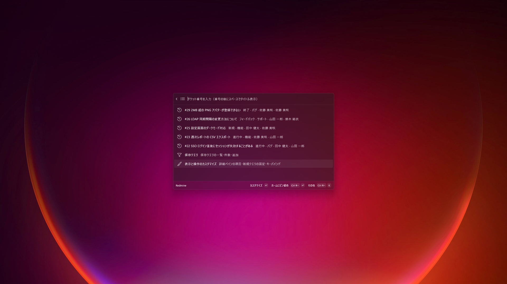
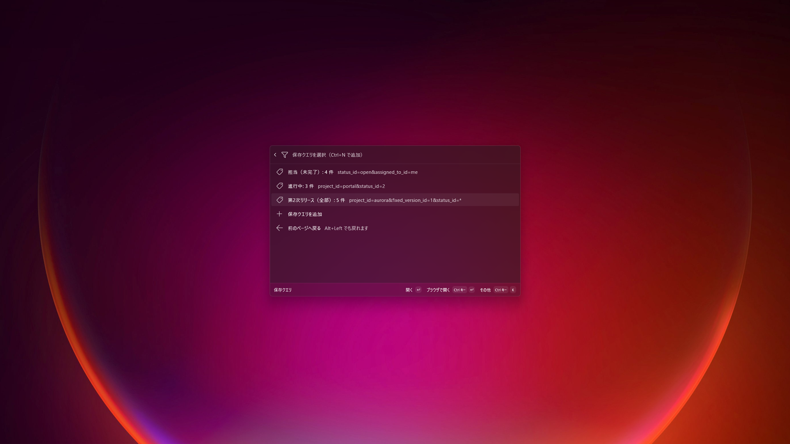
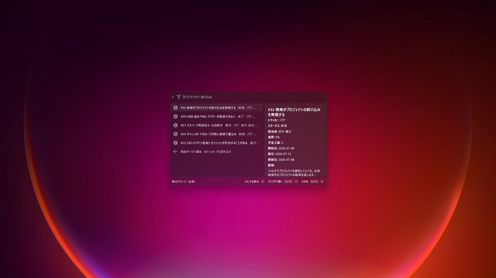
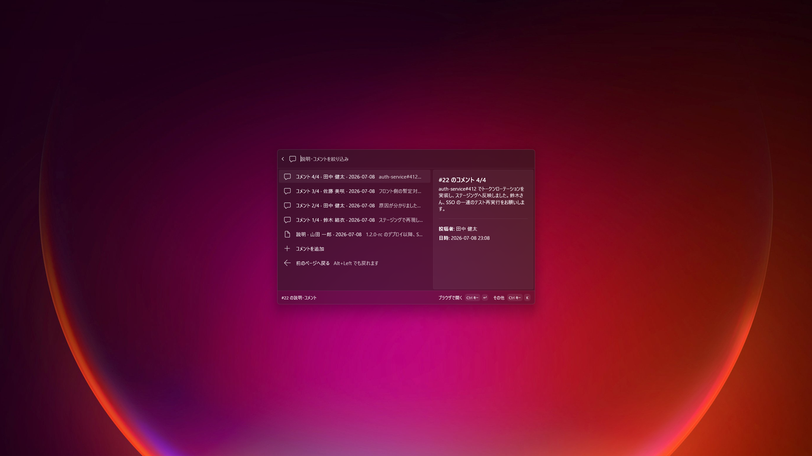
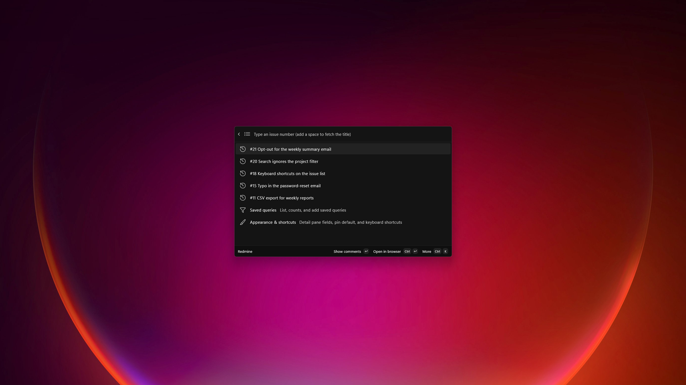

# Redmine for Command Palette

*This page in [English](README.md).*

パレットから離れずに [Redmine](https://www.redmine.org/) を操作する、非公式の
[PowerToys コマンドパレット](https://learn.microsoft.com/windows/powertoys/command-palette/overview)
拡張機能です。

> 「Redmine」は各権利者の商標です。本拡張は独立した非公式のものです。



## 主な機能

- **番号でチケットを開く** — チケット番号を入力（先頭の `#` は任意）。Enter で説明とコメントの
  ページへ遷移し、右ペインに詳細が表示されます。
- **説明・コメントの表示** — コメントには通し番号（`n/総数`）が付き、時系列を一方向に統一して
  並びます。既定は新しい順（説明が末尾）、Ctrl+O で古い順（説明が先頭。Redmine の Web 表示と同じ）
  に切り替えられます。
- **最近の履歴** — 検索ボックスが空のとき、直近に開いた・コピーしたチケットを一覧します。件数は
  設定で変更できます。文字を入力すると、保持している履歴全体を番号・タイトルの文章で絞り込めます
  （空白区切りの語は AND）。
- **保存クエリ** — Redmine の `query_id`・生のフィルタクエリ・URL のいずれかを貼り付けて保存します。
  「保存クエリ」ハブに各クエリと件数（キャッシュ）が並び、個別にトップレベルへ固定できます。
- **大量の結果** — クエリ結果は 100 件ずつ読み込みます。末尾までスクロールすると自動で次ページを
  取得し、Ctrl+L でどの項目からでも明示的に追加読み込みできます。
- **簡易編集** — ステータス変更（Ctrl+S）とコメント追加（Ctrl+M）をパレット内で行えます。細かい
  編集は Ctrl+Enter でブラウザを開いて Redmine 上で。
- **明示的な「戻る」導線** — Alt+←（または一覧末尾の「前のページへ戻る」項目）で 1 つ前へ、
  Alt+Home で一気にホームへ戻れます。Esc が「パレットを閉じる」に割り当てられた環境でも戻れます。

### キーバインド（全ページ共通。Enter / Ctrl+Enter の対を除きすべて再割当可能）

| キー（既定） | 動作 |
|-----|--------|
| Enter | ページ遷移: チケット → 説明・コメント、保存クエリ → 結果一覧 |
| Ctrl+Enter | ブラウザで開く（Enter と固定ペア。再割当不可） |
| Ctrl+C | `#番号 タイトル` のリッチリンクをコピー（Teams/Outlook/Word ではクリック可能なリンク、他ではプレーンテキスト） |
| Ctrl+R | 最新に更新（チケット再取得 / クエリ件数の更新） |
| Ctrl+L | クエリ結果の次ページを読み込む |
| Ctrl+O | コメントの並び順を切り替え（新しい順 ⇄ 古い順） |
| Ctrl+S | チケットのステータスを変更 |
| Ctrl+M | チケットにコメントを追加 |
| Ctrl+N / Ctrl+E / Ctrl+Delete | 保存クエリの 追加 / 編集 / 削除 |
| Alt+← | 1 つ前のページへ戻る |
| Alt+Home | ホームまで一気に戻る |

## スクリーンショット

| | |
|---|---|
| <br>*件数（キャッシュ）付きの保存クエリ一覧* | <br>*クエリ結果。右ペインにチケット詳細を表示* |
| <br>*通し番号付きのコメントとプレビュー* | <br>*英語 UI（Windows の表示言語に追従）* |

## 設定

拡張機能の **設定** を開き、以下を入力します。

- **Redmine URL** — Redmine のベース URL。例: `http://redmine/`
- **API アクセスキー** — 個人の Redmine REST API キー。**Windows 資格情報マネージャー**
  （汎用資格情報、ユーザーごとに DPAPI 暗号化）に保存され、平文では保持されません。
- **履歴の表示件数** — 直近チケットの表示数（0〜50、ドロップダウン）。
- **保存クエリ件数の更新間隔** — キャッシュした件数を裏で再取得するまでの猶予（5 分〜3 時間、
  ドロップダウン）。

### カスタマイズ（表示と操作のカスタマイズ）

メインページの **表示と操作のカスタマイズ** フォームで、接続の基本以外を設定できます。

- **詳細ペインの表示項目（既定）** — プロジェクト / トラッカー / ステータス / 優先度 / 担当者 /
  作成者 / カテゴリ / 対象バージョン / 進捗 / 予定工数 / 各日付 / 説明 の複数選択。保存クエリごとに
  編集フォームで上書きできます。
- **コメントの既定の並び順** — コメントページを最初に開いたときの順序（新しい順＝既定 / 古い順）。
  Ctrl+O でその場切り替えも可能。
- **新規保存クエリの固定既定** — 「トップレベルに固定」トグルの初期値。
- **キーバインド** — 一覧は開閉ボタンで折りたたみ。Enter / Ctrl+Enter の固定ペアを除く各コマンドを
  `Ctrl+Shift+K` 形式のテキストで再割当できます。`C+` / `A+` / `S+` / `W+` の短縮形も使えます
  （`C+S+K` = Ctrl+Shift+K。最後のトークンがキーなので `Ctrl+S` の S はキー扱い）。Ctrl / Alt / Win
  のいずれかが必須で、空欄にすると既定へ戻ります。不正・重複は保存時に弾かれます。反映にはページの
  開き直しが必要です。

> できるだけ `https://` の URL を使ってください。API キーは `X-Redmine-API-Key` ヘッダーで送られ、
> 平文 `http://` ではクリアテキストになります。

## 表示言語

UI は Windows の表示言語に追従します（日本語なら日本語、それ以外は英語）。

## インストール

> **状況:** Microsoft Store での公開を準備中です。それまでは **開発者向けのサイドロードのみ** です。
> コマンドパレットは拡張機能を MSIX 登録経由でのみ発見するため、`build-exe.ps1` が生成する EXE
> インストーラーはインストールできても CmdPal には認識されません（詳細は `RELEASING.md`）。

Store 公開までの手順:

1. Windows の **開発者モード** を有効化する。
2. リポジトリをクローンし Visual Studio で開き、**ビルド → 配置**（MSIX をインストール）。
3. コマンドパレット内で **再読み込み（Reload）** を実行する。

## ビルドと実行（開発者向け）

Visual Studio（C#/WinUI ワークロード）と Windows App SDK が必要です。

```sh
dotnet build RedmineExtension.sln -c Debug -p:Platform=x64
```

Visual Studio では **(Package)** 起動プロファイルを選び、**ビルド → 配置** で MSIX パッケージを
登録し、コマンドパレットで **再読み込み（Reload）** を実行します。

## ライセンス

[MIT](LICENSE)。
